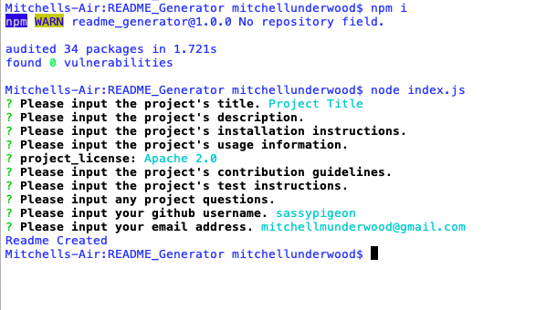
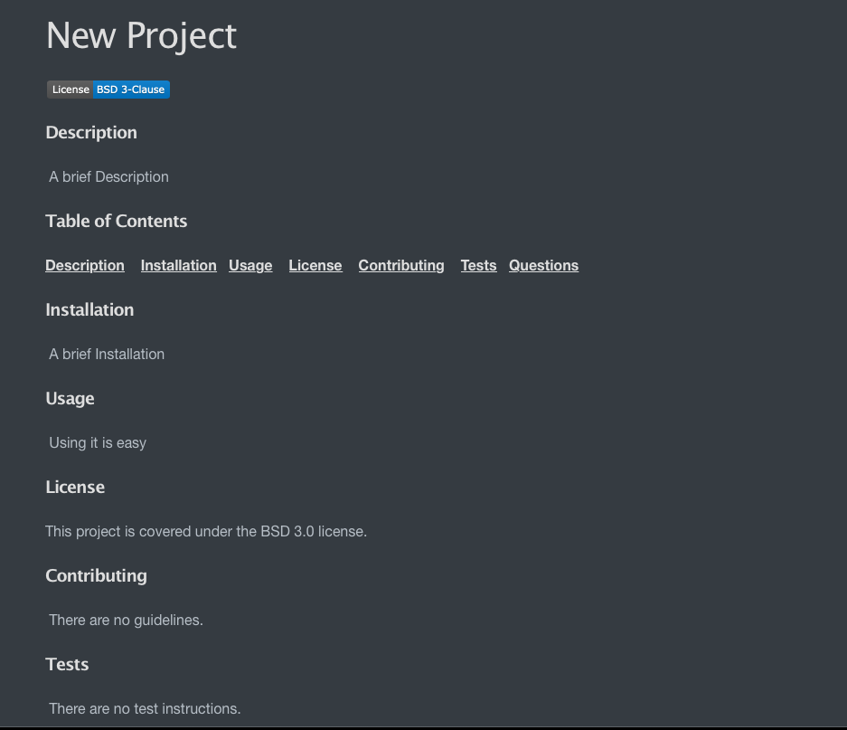

# Project Title 
 
### Description 

### Table of Contents 
[**Description**](#Description)    [**Installation**](#Installation)   [**Usage**](#Usage)    [**License**](#License)    [**Contributing**](#Contributing)    [**Tests**](#Tests)   [**Questions**](#Questions)
### Installation 

### Usage 

### License 
This project is covered under the Apache 2.0 license. 
### Contributing 

### Tests 

### Questions 

For additional projects and materials, go to ***[github.com/sassypigeon](https://github.com/sassypigeon)*** 
For additional questions, email me at ***mitchellmunderwood@gmail.com*** 

### Images

